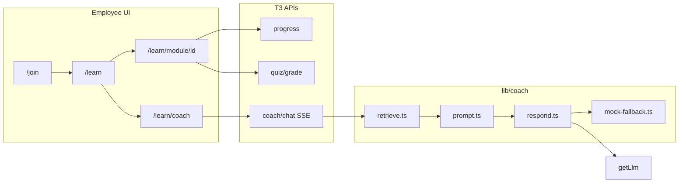

# Track 3 — Slash-Goal Implementation Plan

> **For Claude Code `/goal`:** Run goals **G0 → G12 in order**. Each goal is self-contained. Do not skip verification steps. Do not mark a goal done until its **Done when** checklist passes.

---

## 0. Zero-context briefing (read this first)

### What is Trainr.ai?

Trainr.ai is a Next.js 16 hackathon app. A **business owner** uploads operational knowledge; the system generates a **training program** (modules + quizzes). **Employees** join with a code, complete modules, take quizzes, and chat with an **AI Training Coach** that answers from the owner's actual content — not generic internet knowledge.

### What is Track 3 (your job)?

You own **everything the employee sees** plus the **coach agent backend**:

| In scope | Out of scope (do NOT edit) |
|----------|---------------------------|
| `app/(employee)/` | `app/(owner)/`, `app/(auth)/` except one join-page patch |
| `app/api/coach/`, `app/api/quiz/`, `app/api/progress/` | `app/api/auth/`, `app/api/business/`, `app/api/pipeline/` |
| `lib/coach/`, `lib/employee/` | `lib/db/`, `lib/auth/`, `lib/integrations/`, `lib/agents/` |
| `components/employee/`, `skills/` | `components/owner/`, `types/`, `lib/contracts/` (frozen) |

Call existing adapters — never reimplement them:
- `getDb()` from [`lib/contracts/db.ts`](lib/contracts/db.ts)
- `getLlm()` from [`lib/contracts/llm.ts`](lib/contracts/llm.ts)
- `getStorage()` from [`lib/contracts/storage.ts`](lib/contracts/storage.ts)

### Current state (starting point)

Phase 0 is merged. These exist but are **stubs only**:

| File | What it does today | What's missing |
|------|-------------------|----------------|
| [`app/(auth)/join/page.tsx`](app/(auth)/join/page.tsx) | Join form → redirects to `/learn` | `/learn` route does not exist (404) |
| [`app/api/auth/employee/join/route.ts`](app/api/auth/employee/join/route.ts) | Creates employee user | No session cookie; client must persist identity |
| [`app/api/progress/route.ts`](app/api/progress/route.ts) | Upserts progress | Ignores `certified` field |
| [`app/api/quiz/[moduleId]/grade/route.ts`](app/api/quiz/[moduleId]/grade/route.ts) | MC auto-grade | Free-response → `needsReview: true`, no LLM |
| [`app/api/coach/[businessId]/chat/route.ts`](app/api/coach/[businessId]/chat/route.ts) | Streams mock tokens | No retrieval, citations, or chat persistence |

These **do not exist yet**: `app/(employee)/`, `components/employee/`, `lib/coach/`, `skills/`.

### Demo fixture (build against this)

[`lib/mocks/fixtures.ts`](lib/mocks/fixtures.ts) — Happy Lemon boba shop:

- Join code: **`HLEMON`** (`DEMO_JOIN_CODE`)
- Business id: `IDS.business` (`biz_happy_lemon_mission`)
- 8 modules: `mod_company_intro`, `mod_pos_cash`, `mod_drink_build`, `mod_pearl_prep`, `mod_food_safety`, `mod_breaks_labor`, `mod_harassment`, `mod_open_close`
- Some modules have `languageVariants['zh-Hans']`
- `mod_company_intro` quiz has MC + free-response with rubric
- `demoChat` shows expected coach behavior: complaint question → answer citing `mod_pos_cash`

### Human intervention (only this)

| Scenario | User action | Agent action |
|----------|-------------|--------------|
| **Default (hackathon demo)** | Nothing. `USE_MOCKS=true` in `.env.local` | All features work via `lib/coach/mock-fallback.ts` + keyword retrieval. No API keys needed. |
| **Live Sonnet** | Add `ANTHROPIC_API_KEY=sk-...` to `.env.local`, set `USE_MOCKS=false` | Same code calls `getLlm()`. Real responses when T2 wires `lib/integrations/anthropic.ts`; until then mock-fallback still satisfies DoD. |

**Never** ask the user to run commands beyond `npm install`, `npm run dev`, `npm run build`, and adding the API key.

### Mandatory reading before coding

1. [`docs/tracks/TRACK_3_employee_coach.md`](docs/tracks/TRACK_3_employee_coach.md)
2. [`docs/PLAN.md`](docs/PLAN.md) — §5 (API routes), §6 (ownership), §8 (demo script step 6)
3. [`types/index.ts`](types/index.ts) — frozen; do not edit without [`docs/INTEGRATION_LOG.md`](docs/INTEGRATION_LOG.md) proposal
4. Next.js 16 streaming: skim `node_modules/next/dist/docs/` for route handler streaming (or use an Explore subagent)

### API response shape (all routes)

```ts
// Success: { ok: true, data: T }
// Error:   { ok: false, error: string }
```

Helpers: `ok()`, `fail()`, `readJson()` from [`lib/http.ts`](lib/http.ts).

---

## Architecture



### Coach SSE protocol (canonical — implement exactly)

`POST /api/coach/:businessId/chat` returns `Content-Type: text/event-stream`.

```
data: {"type":"token","text":"Apologize"}

data: {"type":"token","text":" and"}

data: {"type":"done","citations":[{"moduleId":"mod_pos_cash","title":"Cashier: POS","snippet":"Always confirm sugar level"}],"sessionId":"sess_abc"}
```

Client parses line-by-line `data: ` JSON. On `done`, render citation chips linking to `/learn/module/{moduleId}`.

---

## Goals (run in order with `/goal`)

---

### G0 — Preflight

**Depends on:** nothing

**Objective:** Confirm repo builds; create working branch.

**Deliverables:**
- Branch `track/3-employee` off `main`
- Confirm [`components/ui/Button.tsx`](components/ui/Button.tsx) exists (build blocker if missing)

**Commands (must all exit 0):**
```bash
git checkout -b track/3-employee
npx tsc --noEmit
npm run build
```

**Done when:**
- [ ] On branch `track/3-employee`
- [ ] `tsc` and `build` pass with zero errors

---

### G1 — Employee session + join flow

**Depends on:** G0

**Objective:** After join, employee identity persists and `/learn` loads (no 404).

**Deliverables:**

| File | Purpose |
|------|---------|
| `lib/employee/session.ts` | `EmployeeSession` type, `saveSession`, `loadSession`, `clearSession` via `localStorage` key `trainr_employee_session` |
| `components/employee/EmployeeProvider.tsx` | React context; redirect to `/join` if no session |
| `app/(employee)/learn/page.tsx` | Placeholder page ("Loading training…") wrapped in provider |
| Patch [`app/(auth)/join/page.tsx`](app/(auth)/join/page.tsx) | On success: `saveSession({ userId: json.data.user.id, businessId: json.data.businessId, name: json.data.user.name })` then `router.push('/learn')` |

**Session shape:**
```ts
interface EmployeeSession {
  userId: string;
  businessId: string;
  name: string;
  preferredLanguage?: string; // BCP-47, default 'en'
  coachSessionId?: string;    // nanoid, created on first coach visit
}
```

**Done when:**
- [ ] Join with `HLEMON` + any name → lands on `/learn` (not 404)
- [ ] Refresh `/learn` → still logged in (session in localStorage)
- [ ] Clear localStorage → `/learn` redirects to `/join`

---

### G2 — Employee shell + language toggle

**Depends on:** G1

**Objective:** Consistent employee chrome with language switching.

**Deliverables:**

| File | Purpose |
|------|---------|
| `app/(employee)/layout.tsx` | Wrap children in `EmployeeProvider`; header with business name, nav links |
| `components/employee/LanguageToggle.tsx` | Toggle `en` ↔ `zh-Hans` (extend later); updates session + context |
| `components/employee/EmployeeHeader.tsx` | Logo area, language toggle, links: Dashboard (`/learn`), Coach (`/learn/coach`) |

**Rules:**
- Language stored in `EmployeeSession.preferredLanguage` (localStorage). Do NOT modify frozen `User` type.
- Fetch business name via `GET /api/business/:businessId` or hardcode from session context loaded once.

**Done when:**
- [ ] Header visible on all `/learn/*` routes
- [ ] Language toggle switches `preferredLanguage` in session and persists on refresh
- [ ] "Coach" link navigates to `/learn/coach` (page can be placeholder until G11)

---

### G3 — Duolingo-style dashboard

**Depends on:** G2

**Objective:** Module path with progress states and Continue CTA.

**Deliverables:**

| File | Purpose |
|------|---------|
| `components/employee/ModulePath.tsx` | Renders 8 modules as vertical path or grid |
| `components/employee/ModuleCard.tsx` | Single module tile: title, status badge, link |
| `components/employee/ProgressRing.tsx` | Overall completion % using [`components/ui/Progress.tsx`](components/ui/Progress.tsx) |
| `components/employee/ContinueButton.tsx` | Links to first "next" module |
| `lib/employee/module-state.ts` | Pure functions: `getModuleState(module, progress, allModules)` → `locked \| next \| in_progress \| done` |
| Update `app/(employee)/learn/page.tsx` | Fetch program + progress; render dashboard |

**Data fetching (client or server component — your choice):**
```
GET /api/programs/{businessId}  → { program: { modules: [...] } }
GET /api/progress/{employeeId}  → { progress: EmployeeProgress[] }
```

**Locking rule (implement exactly):**
- Module at `order === 1` is always unlocked.
- Module at `order === N` is locked until module at `order === N-1` has `status === 'completed'`.
- First non-completed unlocked module gets state `next`.

**Done when:**
- [ ] Dashboard shows 8 modules from fixture
- [ ] New employee (fresh join): only module 1 unlocked, marked `next`
- [ ] Progress ring shows 0% for new employee
- [ ] "Continue" opens the `next` module
- [ ] Seeded employee `IDS.employee1` progress states render correctly if you manually set session to that id (optional dev test)

---

### G4 — Module viewer

**Depends on:** G3

**Objective:** Read module content in selected language; mark complete; link to quiz and coach.

**Deliverables:**

| File | Purpose |
|------|---------|
| `app/(employee)/learn/module/[id]/page.tsx` | Module viewer page |
| `components/employee/ModuleMarkdown.tsx` | Renders markdown with styled headings/lists |
| Add `react-markdown` to `package.json` | Dedicated dependency commit |

**Content selection:**
```ts
const lang = session.preferredLanguage ?? 'en';
const body = module.languageVariants?.[lang] ?? module.contentMarkdown;
```

**Actions on page:**
- **Mark complete** → `POST /api/progress` `{ employeeId, businessId, moduleId, status: 'completed' }`
- **Take quiz** → scroll to or navigate to quiz section (G9 adds `QuizPanel` inline)
- **Ask the coach** → link to `/learn/coach?moduleId={id}&prefill=I'm%20on%20module%20{title}`

**Provenance:** If `sourceArtifactIds?.length`, show subtle footer: "Based on your store's training materials."

**Done when:**
- [ ] `/learn/module/mod_company_intro` renders markdown
- [ ] Toggle language to `zh-Hans` → shows Chinese variant for modules that have it; English fallback otherwise
- [ ] "Mark complete" updates progress (visible on dashboard after return)
- [ ] "Ask the coach" link includes module context in URL

---

### G5 — Progress API: certified field

**Depends on:** G0

**Objective:** Quiz pass can set `certified: true` on progress records.

**Deliverables:**
- Update [`app/api/progress/route.ts`](app/api/progress/route.ts):
  - Accept `certified?: boolean` in POST body
  - Persist on create/update of `EmployeeProgress`

**Done when:**
- [ ] `curl -X POST localhost:3000/api/progress -H 'content-type: application/json' -d '{"employeeId":"test","moduleId":"mod_company_intro","status":"completed","quizScore":85,"certified":true,"businessId":"biz_happy_lemon_mission"}'` returns progress with `certified: true`

---

### G6 — Claude Skills + loader

**Depends on:** G0

**Objective:** Author skills and load them at runtime in API routes.

**Deliverables:**

| File | Purpose |
|------|---------|
| `skills/quiz-grader/SKILL.md` | Instructions: given questions with rubrics + student answers → return JSON array `[{ id, correct, feedback, partialCredit? }]` and overall score |
| `skills/scenario-coach/SKILL.md` | Instructions: given module context + topic → generate role-play scenario; evaluate employee response with structured feedback |
| `lib/coach/load-skill.ts` | `loadSkill(name: 'quiz-grader' | 'scenario-coach'): string` reads `skills/{name}/SKILL.md` from disk |

**quiz-grader output schema (document in SKILL.md):**
```json
{
  "perQuestion": [{ "id": "q2", "correct": true, "feedback": "Great — you mentioned both speed and friendliness." }],
  "score": 85,
  "summary": "Nice work! One thing to tighten: ..."
}
```

**Done when:**
- [ ] Both SKILL.md files exist with clear input/output contracts
- [ ] `loadSkill('quiz-grader')` returns non-empty string in a route handler
- [ ] Grep shows `loadSkill` or `skills/quiz-grader` referenced in quiz grade route (after G8)

---

### G7 — Coach library (retrieval + prompts + offline fallback)

**Depends on:** G6

**Objective:** Core coach intelligence — works **without any API key**.

**Deliverables:**

| File | Purpose |
|------|---------|
| `lib/coach/retrieve.ts` | `retrieveModules(businessId, query, limit=3)` — keyword token overlap scoring on title + contentMarkdown |
| `lib/coach/citations.ts` | `toCitations(modules, query)` → `ChatCitation[]` with snippet extraction (~120 chars around best matching line) |
| `lib/coach/prompt.ts` | `buildCoachSystemPrompt({ business, modules, language })` — persona, rules, module excerpts |
| `lib/coach/mock-fallback.ts` | When `getLlm()` returns generic mock text OR `USE_MOCKS=true`, synthesize answer from retrieved modules |
| `lib/coach/respond.ts` | `coachRespond(opts)` → async generator yielding `{ type: 'token', text }` then `{ type: 'done', citations }` |
| `lib/coach/constants.ts` | `COACH_MODEL = 'claude-sonnet-4-6'`, complaint keywords list |

**System prompt rules (must be in prompt.ts):**
1. You are a patient trainer for `{business.name}`.
2. Answer ONLY from provided module excerpts. Never invent policy.
3. If answer not in context: say "I'm not sure — please ask your manager."
4. Respond in `{language}`.
5. For complaint/customer-service questions: Policy → Example → Offer practice scenario.
6. Cite module titles when stating policies.

**mock-fallback.ts complaint flow (must work offline):**
Query contains `complain`, `complaint`, `unhappy`, `upset`, `wrong drink`, etc.:
1. Retrieve `mod_pos_cash` (or highest-ranked module)
2. Return structured answer matching [`demoChat`](lib/mocks/fixtures.ts) spirit
3. Include citation to `mod_pos_cash`
4. End with: "Want to practice? Describe what you'd say to the customer."

**Done when:**
- [ ] Unit-style smoke: `retrieveModules(IDS.business, 'customer complains drink too sweet')` returns `mod_pos_cash` in top 3
- [ ] `coachRespond` yields tokens then done event with non-empty citations
- [ ] Query "What is the corporate vacation policy at Google?" (not in modules) → response contains "ask your manager" or equivalent deferral

---

### G8 — Quiz grade API (MC + LLM free-response)

**Depends on:** G6, G7 (for shared `loadSkill`)

**Objective:** Grade all question types; free-response uses quiz-grader skill via `getLlm()`.

**Deliverables:**
- Rewrite [`app/api/quiz/[moduleId]/grade/route.ts`](app/api/quiz/[moduleId]/grade/route.ts)
- Add `lib/coach/grade-quiz.ts` — orchestrates MC + LLM grading

**Logic:**
1. Load quiz from program (existing code)
2. MC: compare `answers[q.id]` to `q.correctIndex` → `{ correct, feedback: correct ? 'Correct!' : 'Not quite — review the module and try again.' }`
3. Free-response: call `getLlm().generate({ system: loadSkill('quiz-grader') + rubric + question, messages: [{ role: 'user', content: answer }] })`
4. Parse JSON from LLM response (strip markdown fences if present); zod validate
5. **Offline fallback** when mocks: keyword-match against rubric tokens in [`lib/coach/grade-quiz-mock.ts`](lib/coach/grade-quiz-mock.ts) — must return specific feedback, not generic stub
6. Return:
```ts
{ score: number, perQuestion: [{ id, correct, feedback, needsReview? }], feedback: string }
```

**Pass threshold:** `score >= 70` → client should POST progress with `certified: true`.

**Done when:**
- [ ] POST grade for `mod_company_intro` with correct MC + good free-response → score >= 70, per-question feedback present
- [ ] POST with bad free-response → specific feedback mentioning what was missing (per rubric)
- [ ] Works with `USE_MOCKS=true` (no API key)

---

### G9 — Quiz UI

**Depends on:** G4, G5, G8

**Objective:** Interactive quiz on module page with encouraging results.

**Deliverables:**

| File | Purpose |
|------|---------|
| `components/employee/QuizPanel.tsx` | Renders all questions; MC radio buttons; free-response textarea |
| `components/employee/QuizQuestion.tsx` | Single question UI |
| `components/employee/QuizResults.tsx` | Score, per-question feedback, pass/fail celebration |
| Update `app/(employee)/learn/module/[id]/page.tsx` | Embed `QuizPanel` when module has quiz |

**On submit:**
1. `POST /api/quiz/{moduleId}/grade` with `{ businessId, answers }`
2. If `score >= 70`: `POST /api/progress` with `{ status: 'completed', quizScore: score, certified: true }`
3. Show `QuizResults` with Duolingo energy copy ("Nice!", "Almost there — …")

**Done when:**
- [ ] Can complete `mod_company_intro` quiz end-to-end in browser
- [ ] MC shows instant correct/incorrect after grade
- [ ] Free-response shows LLM/mock feedback text
- [ ] Pass updates dashboard progress + quiz score

---

### G10 — Coach streaming API + persistence

**Depends on:** G7

**Objective:** Production coach endpoint with SSE, citations, chat history in DB.

**Deliverables:**
- Rewrite [`app/api/coach/[businessId]/chat/route.ts`](app/api/coach/[businessId]/chat/route.ts)

**Request body:**
```ts
{ sessionId?: string, message: string, employeeId?: string, language?: string, moduleId?: string }
```

**Handler flow:**
1. Resolve/create `sessionId` (return in `done` event if new)
2. Load business + prior chat: `getDb().chat.list({ sessionId })`
3. Persist user message: `getDb().chat.create(...)`
4. If `moduleId` provided, boost that module in retrieval
5. Stream via `coachRespond()` using SSE protocol defined above
6. After stream: persist assistant message with `citations`
7. Pass `cache: true` and `model: 'claude-sonnet-4-6'` in `GenerateOpts` when calling `getLlm()`

**Done when:**
- [ ] `curl -N -X POST localhost:3000/api/coach/biz_happy_lemon_mission/chat -H 'content-type: application/json' -d '{"message":"What do I do if a customer complains?","language":"en"}'` streams SSE tokens then `done` with citations
- [ ] Second message in same `sessionId` includes conversation context
- [ ] `getDb().chat.list({ sessionId })` returns user + assistant messages after request

---

### G11 — Coach UI

**Depends on:** G2, G10

**Objective:** Full chat interface with live streaming and citation links.

**Deliverables:**

| File | Purpose |
|------|---------|
| `app/(employee)/learn/coach/page.tsx` | Coach page |
| `components/employee/CoachChat.tsx` | Message list, input, SSE consumer, citation chips |
| `components/employee/CitationChip.tsx` | Link to `/learn/module/{moduleId}` |
| `lib/employee/coach-client.ts` | `streamCoachChat(businessId, body, onToken, onDone)` — parses SSE |

**UX:**
- Pre-fill from URL params: `?moduleId=&prefill=`
- Show typing indicator while streaming
- Citation chips appear after `done` event
- Persist `coachSessionId` in employee session

**Done when:**
- [ ] `/learn/coach` loads and accepts messages
- [ ] Tokens appear incrementally (streaming visible)
- [ ] Citation chip links to correct module page
- [ ] Complaint question triggers multi-part answer (policy + example + practice offer)

---

### G12 — Final verification (Definition of Done)

**Depends on:** G1–G11

**Objective:** Prove all Track 3 requirements. **This is the only goal that marks the project complete.**

**Automated checks (must pass):**
```bash
npx tsc --noEmit
npm run build
```

**Manual smoke script (run with `npm run dev`):**

| Step | Action | Expected |
|------|--------|----------|
| 1 | Go to `/join`, enter `HLEMON` + name | Redirect to `/learn` |
| 2 | View dashboard | 8 modules, progress ring, Continue button |
| 3 | Open first module | Markdown renders |
| 4 | Toggle 中文 | Chinese content on `mod_company_intro` |
| 5 | Take quiz on `mod_company_intro` | MC + free-response feedback; pass sets progress |
| 6 | Go to Coach, ask "What do I do if a customer complains?" | Streamed answer, citation to module, practice scenario offered |
| 7 | Reply to scenario with sample employee response | Coach evaluates (scenario-coach skill / mock) |
| 8 | Ask "What is the pet leave policy?" (not in training) | Defers to manager; no invented policy |
| 9 | Set `ANTHROPIC_API_KEY` + `USE_MOCKS=false` in `.env.local`, restart | Coach + quiz still function (real or fallback) |

**Definition of Done (all must be checked):**
- [ ] 1. Join → dashboard → open modules
- [ ] 2. Module viewer + language toggle with fallback
- [ ] 3. Quizzes: MC + free-response graded with feedback; progress persists
- [ ] 4. Coach streams, cites real modules, complaint demo flow works
- [ ] 5. Coach refuses to invent policy
- [ ] 6. `skills/quiz-grader` + `skills/scenario-coach` exist and are loaded by routes
- [ ] 7. Works with zero keys (`USE_MOCKS=true`)
- [ ] 8. `tsc` + `build` clean; no edits outside T3 ownership
- [ ] 9. Demo step 6 from PLAN.md works end-to-end

**Done when:** All 9 DoD boxes checked + smoke table passes.

---

## Complete file tree (final state)

```
app/(employee)/
  layout.tsx
  learn/page.tsx
  learn/module/[id]/page.tsx
  learn/coach/page.tsx

app/api/
  progress/route.ts          (modified — certified)
  quiz/[moduleId]/grade/route.ts  (modified — LLM grading)
  coach/[businessId]/chat/route.ts (modified — SSE + persistence)

components/employee/
  EmployeeProvider.tsx
  EmployeeHeader.tsx
  LanguageToggle.tsx
  ModulePath.tsx
  ModuleCard.tsx
  ProgressRing.tsx
  ContinueButton.tsx
  ModuleMarkdown.tsx
  QuizPanel.tsx
  QuizQuestion.tsx
  QuizResults.tsx
  CoachChat.tsx
  CitationChip.tsx

lib/employee/
  session.ts
  module-state.ts
  coach-client.ts

lib/coach/
  retrieve.ts
  citations.ts
  prompt.ts
  respond.ts
  mock-fallback.ts
  load-skill.ts
  grade-quiz.ts
  grade-quiz-mock.ts
  constants.ts

skills/
  quiz-grader/SKILL.md
  scenario-coach/SKILL.md
```

**One allowed patch outside strict T3 ownership:**
- [`app/(auth)/join/page.tsx`](app/(auth)/join/page.tsx) — add `saveSession()` call (3 lines). Required because redirect target is `/learn`.

---

## Troubleshooting

| Problem | Fix |
|---------|-----|
| `/learn` 404 | G1 not done — create `app/(employee)/learn/page.tsx` |
| Join succeeds but dashboard empty | Session not saved — check G1 join patch |
| Coach returns generic mock sentence | `mock-fallback.ts` not wired — check G7 |
| Free-response always `needsReview` | G8 not done |
| `tsc` fails on Button | Restore `components/ui/Button.tsx` |
| Citations empty | Retrieval returned no modules — check query tokenization in G7 |
| Real API key but still mock responses | Expected until T2 wires `lib/integrations/anthropic.ts`; mock-fallback must still pass DoD |

---

## What NOT to do

- Do not edit `types/index.ts` or `lib/contracts/*` without INTEGRATION_LOG proposal
- Do not implement Insforge/Anthropic directly in T3 files
- Do not generate translations (T4 owns `languageVariants` population — you only read them)
- Do not skip G12 verification
- Do not declare Track 3 complete until all DoD items pass
