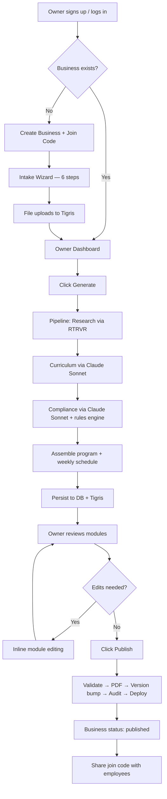
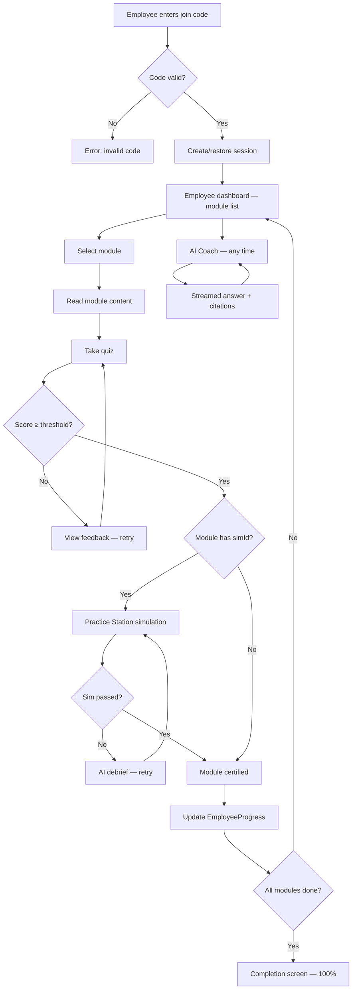
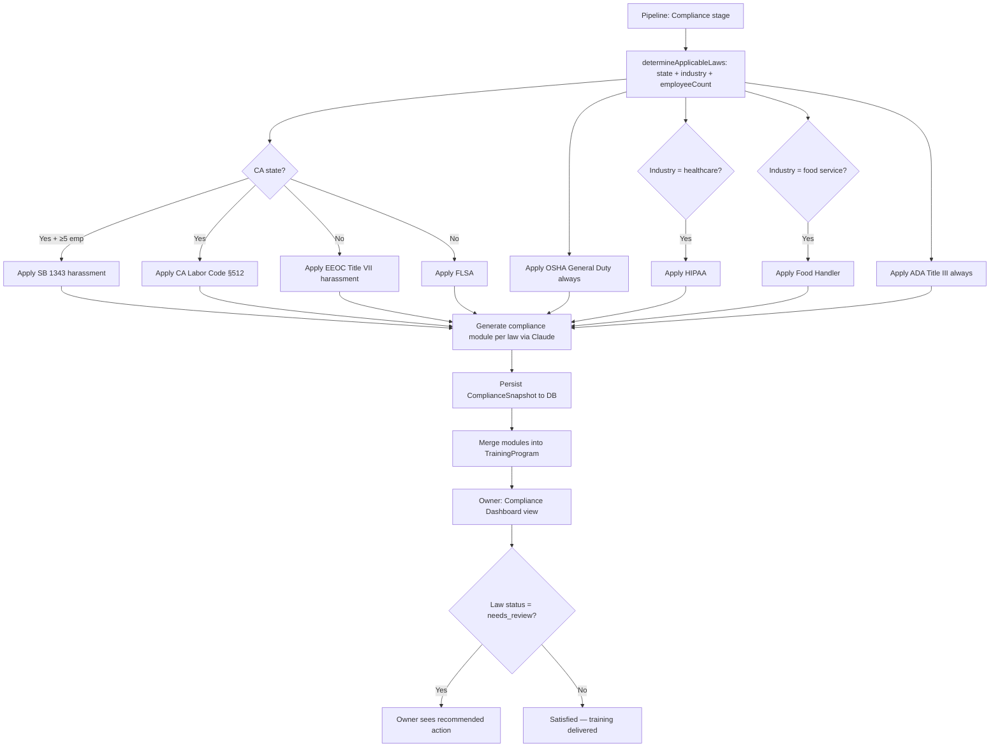

# Business Requirements Document — Trainr
**Version:** 1.0.0
**Generated:** 2026-05-31 (Opsera business-docs-generate)
**Status:** Baseline

---

## Table of Contents

1. [Executive Summary](#1-executive-summary)
2. [Business Context](#2-business-context)
3. [Business Objectives](#3-business-objectives)
4. [Stakeholder Personas](#4-stakeholder-personas)
5. [Business Process Flows](#5-business-process-flows)
6. [Business Rules and Policies](#6-business-rules-and-policies)
7. [KPIs](#7-kpis)
8. [Scope Boundaries](#8-scope-boundaries)
9. [Dependencies](#9-dependencies)

---

## 1. Executive Summary

**Trainr** is an AI-powered employee training SaaS that compresses 60–80 hours of manual training program development into minutes for small and minority-owned businesses. Owners input their operational knowledge (recipes, roles, policies, SOPs) once; an autonomous AI pipeline produces a structured, multilingual, compliance-verified training program. Employees complete training through an interactive platform with quizzes, equipment simulations, and a 24/7 AI coach that answers questions grounded in the business's actual documentation.

**Core value proposition:** Small business owners currently have no affordable, fast path to a professional, legally-compliant training program. Trainr eliminates the consultant, the template wrangling, and the compliance guesswork — turning raw operational knowledge into a deployable training program in under 5 minutes of owner interaction.

**Hackathon context:** Built in a single-day sprint for the AI Agents hackathon under the "Agents That Act" / Education & Small Business theme. Sponsor integrations: RTRVR.ai (research), Tigris (storage), InsForge (backend), Opsera MCP (governance), Anthropic Claude (generation + coaching).

---

## 2. Business Context

### Problem Statement

Small and minority-owned businesses — restaurants, retail shops, service providers — face three compounding training problems:

1. **No time or budget** to write training manuals. Most rely on informal shadowing, which produces inconsistent employee behavior and compliance gaps.
2. **Compliance exposure.** CA labor law, OSHA, ADA, harassment prevention requirements apply even to 5-person operations. Violations carry fines of $5,000–$25,000+. Most owners don't know which laws apply to them.
3. **Language barriers.** The workforce is frequently multilingual; English-only training leaves non-native speakers at a disadvantage and increases incident risk.

### Market Opportunity

- 33 million small businesses in the US employ 61 million workers.
- 45% of small businesses have no formal onboarding or training process.
- Compliance training market: $4.8B annually, growing at 9% CAGR.
- Existing solutions (TalentLMS, Trainual, etc.) require owners to write content from scratch — the barrier Trainr eliminates.

### Solution

Trainr uses an agentic pipeline to do the heavy lifting: it researches the applicable standards for the business's industry and state, generates role-specific and operations training modules, automatically applies the correct compliance framework, and packages everything into a downloadable handbook plus an interactive employee-facing platform. The owner's total interaction time is under 10 minutes.

---

## 3. Business Objectives

### BO-01 · Reduce Owner Setup Time to Under 10 Minutes

**Rationale:** The primary barrier to adoption is the time cost of building a training program. If owners spend less than 10 minutes of active interaction time (wizard + review), Trainr is a no-brainer.

**Target:** 90% of owners complete the intake wizard in < 8 minutes; 90% publish within 30 minutes of first login (including generation wait time).

**Measure:** Intake wizard completion time, time from first login to first publish (captured via `AuditEvent` timestamps).

---

### BO-02 · Ensure Compliance Coverage for Applicable Laws

**Rationale:** Compliance is the highest-stakes deliverable. An owner who gets hit with a CA harassment training violation fine will attribute it to Trainr if the compliance module was absent or incorrect.

**Target:** 100% of generated programs include a compliance module for every law the rules engine determines applicable. Zero programs published with a missing compliance module.

**Measure:** Ratio of `ComplianceSnapshot.laws` with `status === 'satisfied'` or `needs_review` vs total applicable laws at publish time. Alert if any law determination is skipped.

---

### BO-03 · Drive Employee Completion Rates ≥ 70%

**Rationale:** A training program that employees don't complete provides no value and creates liability (owner can't demonstrate employees were trained).

**Target:** 70% of enrolled employees complete all modules within 2 weeks of program publish.

**Measure:** `EmployeeProgress` records — count of employees with 100% completion / total employees per business, measured at 14 days post-publish.

---

### BO-04 · Multilingual Reach for 3 Core Languages

**Rationale:** The target customer (small, minority-owned businesses) frequently employs Spanish and Chinese-speaking workers who are underserved by English-only platforms.

**Target:** All generated programs available in English, Spanish, and Simplified Chinese within 24 hours of publish.

**Measure:** Tigris key existence for `${businessId}/i18n/es/` and `${businessId}/i18n/zh-Hans/` within 24h of first publish event.

---

### BO-05 · Build an Auditable, Tamper-Evident Governance Trail

**Rationale:** In a compliance dispute, the owner needs to demonstrate who was trained, on what version, and when the program was published. Tamper-evident audit logs provide this evidence.

**Target:** Every publish, generation, and edit action produces an `AuditEvent` record. The audit trail is readable from the Deploy page within the app.

**Measure:** Audit event count per business per month; zero missing events for publish actions (verified by comparing `Business.status` changes to `AuditEvent` records).

---

## 4. Stakeholder Personas

### Persona 1 · The Owner — Mrs. Xiao, Happy Lemon (Mission St)

**Background:** First-generation immigrant, runs a boba tea shop in San Francisco's Mission District. 20 employees, mostly part-time. English is her second language. Has never written a formal training manual — she currently trains by walking new hires through the store over 2 days.

**Goals:**
- Get new hires productive in their first week without pulling herself off the floor for 8 hours.
- Know she's not accidentally breaking CA labor laws.
- Have something in writing she can point to if an employee dispute arises.

**Frustrations:**
- Every training solution she's looked at requires her to write the content herself.
- She doesn't know which compliance laws apply to her.
- Her employees speak English, Spanish, and Mandarin — she can't train all of them the same way.

**How Trainr helps:** She enters her recipes and policies once. The AI generates 8 modules, a weekly schedule, and 5 compliance modules (CA labor, harassment, OSHA, ADA, food-handler). She reviews for 15 minutes, hits publish, gives employees the join code. Done.

**Key touchpoints:** Intake Wizard → Generation wait → Program Review → Publish → Compliance Dashboard.

---

### Persona 2 · The Employee — Carlos, Barista (Week 1)

**Background:** 19-year-old, first week at Happy Lemon. Speaks Spanish natively; conversational English. Has worked in food service before but never received formal training — usually just shadowed someone for a day.

**Goals:**
- Know exactly how to make each drink correctly.
- Not get in trouble for doing something wrong.
- Ask questions without bothering his manager.

**Frustrations:**
- Written manuals are boring and hard to follow.
- He's embarrassed to keep asking the same questions.
- He doesn't always understand training materials in English.

**How Trainr helps:** He enters the join code, sees his Week 1 modules in Spanish, practices drink builds on the interactive station, and asks the AI coach "¿Cómo hago un mango slush?" — getting a step-by-step answer grounded in Mrs. Xiao's actual recipe.

**Key touchpoints:** Join flow → Module list → Quiz → Practice Station → AI Coach → Language toggle.

---

### Persona 3 · The Compliance Officer / Auditor (External)

**Background:** A labor board auditor or the owner's attorney reviewing the business's training records in response to an employee complaint or inspection.

**Goals:**
- Confirm that the employer provided required training (e.g. harassment prevention for CA employers with ≥5 employees).
- Verify when training was deployed and which employees completed it.
- Identify the source materials used in the training.

**How Trainr helps:** The Compliance Dashboard shows which laws were applied and why. The audit trail shows when each version was published. `EmployeeProgress` records show completion status per employee. The PDF handbook serves as a durable artifact.

**Key touchpoints:** Compliance Dashboard → Audit Trail → PDF handbook download → EmployeeProgress export.

---

## 5. Business Process Flows

### BP-01 · Owner Build-and-Deploy Flow

---

### BP-02 · Employee Learning Journey

---

### BP-03 · Compliance Determination and Governance

---

## 6. Business Rules and Policies

| ID | Rule | Rationale |
|---|---|---|
| BR-01 | One active Business per Owner. `POST /api/business` is idempotent — returns existing record rather than creating a duplicate. | Prevents orphaned businesses and billing confusion at scale. |
| BR-02 | Employees are bound to exactly one Business via join code. They cannot switch businesses from within the app. | Maintains data isolation and prevents cross-business data leakage. |
| BR-03 | Training content is not visible to employees until `Business.status === 'published'`. Draft programs are owner-only. | Prevents employees from seeing incomplete or unapproved content. |
| BR-04 | Module certification requires passing all gates defined on the module (quiz AND simulation if `simId` is set). Quiz-only completion is insufficient when a simulation is configured. | Ensures skill demonstration matches the module's learning objectives. |
| BR-05 | Compliance law determination is fully automated and non-overridable by the owner. Owners can take recommended actions for `needs_review` laws, but cannot remove a law from the snapshot. | Prevents owners from suppressing required compliance training for liability reasons. |
| BR-06 | Program versions are immutable after publish. Generating new content creates version n+1; prior versions remain in Tigris indefinitely. | Preserves the audit trail — auditors must be able to see what was deployed when. |
| BR-07 | The join code is the sole employee credential. There is no employee email or password. Owners are responsible for managing access; revoking access requires regenerating the join code. | Optimizes for zero-friction employee onboarding; small businesses cannot reliably collect employee email addresses. |
| BR-08 | Audit events are append-only. No application interface may modify or delete an existing `AuditEvent` record. | Legal requirement for tamper-evident compliance records. |

---

## 7. KPIs

### KPI-01 · Owner Time-to-Publish

**Definition:** Time elapsed from an owner's first login to their first `publish` AuditEvent, measured in minutes.

**Target:** Median ≤ 20 minutes (including ~5–8 minute pipeline generation wait).

**Measurement:** `AuditEvent.timestamp` (first publish) − `User.createdAt` (owner), aggregated per business.

**Data source:** InsForge `trainr_audit` + `trainr_users` tables.

---

### KPI-02 · Program Generation Success Rate

**Definition:** Percentage of generation runs that reach `Business.status === 'ready'` without manual retry.

**Target:** ≥ 95% first-run success rate.

**Measurement:** Count of businesses reaching `status=ready` on first pipeline trigger / total first pipeline triggers.

**Data source:** Tigris `run-status.json` records; `trainr_businesses` status column.

---

### KPI-03 · Employee 14-Day Completion Rate

**Definition:** Percentage of employees who complete all modules within 14 days of their business's first publish date.

**Target:** ≥ 70%.

**Measurement:** Employees with `EmployeeProgress` 100% completion at 14 days post-publish / total employees per business.

**Data source:** InsForge `trainr_progress` table joined on `trainr_businesses.publishedAt`.

---

### KPI-04 · Compliance Coverage Rate

**Definition:** Percentage of published programs where every law determined applicable has a corresponding `TrainingModule` with status `satisfied` or `needs_review` (i.e., no determination was skipped or errored).

**Target:** 100%.

**Measurement:** Count of `ComplianceSnapshot.laws` with a linked module / total `ComplianceSnapshot.laws`, per program.

**Data source:** InsForge `trainr_compliance` snapshots.

---

### KPI-05 · Coach Session Engagement

**Definition:** Average number of coach messages per employee per 30-day period.

**Target:** ≥ 5 messages/employee/month (indicates the coach is being used as intended, not just opened and closed).

**Measurement:** Count of `ChatMessage` records per `userId` per calendar month.

**Data source:** InsForge `trainr_chat` table.

---

### KPI-06 · Multilingual Adoption Rate

**Definition:** Percentage of businesses with at least one non-English translation available within 48 hours of publish.

**Target:** ≥ 60% (reflects the multilingual workforce reality of the target market).

**Measurement:** Count of businesses with Tigris keys under `${businessId}/i18n/es/` OR `${businessId}/i18n/zh-Hans/` within 48h of publish / total published businesses.

**Data source:** Tigris object list + `trainr_audit` publish timestamps.

---

## 8. Scope Boundaries

### In Scope

- Owner onboarding wizard and business creation
- AI-driven 5-stage training program generation pipeline
- Employee dashboard, module viewer, quiz, and equipment simulation
- AI coach (Claude Sonnet) with retrieval and citation
- Compliance dashboard and automated law determination
- Publish pipeline with PDF generation and audit trail
- Multilingual content generation (en / es / zh-Hans)
- Google OAuth for owners
- Join-code-based employee access

### Out of Scope (v1.0)

| Item | Rationale |
|---|---|
| Payroll or scheduling integration | Separate product surface; adds significant compliance complexity |
| Native mobile apps (iOS / Android) | Web-responsive design covers mobile; native adds build/release overhead |
| Video content within modules | Storage cost and generation complexity; text + simulation covers MVP |
| Direct POS integration | Not required for training; adds vendor-specific dependencies |
| Employee-to-employee messaging | Out of learning scope; increases moderation burden |
| NEAR AI confidential inference | Stretch goal only; core pipeline delivers the training value without it |
| Multi-business owner accounts | Single-business per owner is sufficient for the target market at launch |

---

## 9. Dependencies

| Dependency | Type | Status | Risk if Unavailable |
|---|---|---|---|
| **Anthropic Claude** (`claude-sonnet-4-6`) | External API | Live | Pipeline generation fails completely; coach unavailable. No local fallback for production. |
| **RTRVR.ai** | External API | Live (rate-limited) | Research stage falls back to curated mock data; curriculum quality may be lower. App continues to function. |
| **Tigris (S3)** | External storage | Live | File uploads, checkpoints, and PDF generation fail. Pipeline cannot persist checkpoints. |
| **InsForge (Postgres)** | External BaaS | Live | All persistence fails; app cannot function. Local file-backed fallback available for development only. |
| **Google OAuth** | External auth | Live | Google sign-in unavailable; email/password signup remains functional. |
| **`SESSION_SECRET` env var** | Configuration | Must be set in prod | If missing, sessions fall back to a public default; all sessions forgeable. CRITICAL. |
| **Vercel (deployment)** | Infrastructure | Live | App unavailable. Pipeline may time out on Pro plan (60s) for complex programs; needs background job migration for reliability. |
